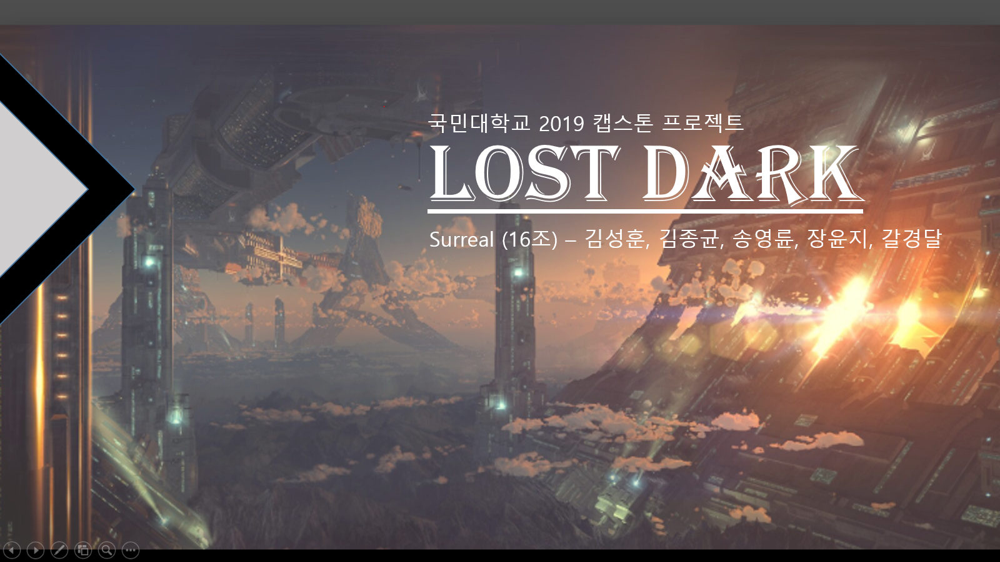

# 2019 소프트웨어 융합대학 캡스톤 디자인Ⅰ 16조 Surreal
[]
# LOST DARK
[]

**팀페이지 주소** -> https://kookmin-sw.github.io/2019-cap1-2019_16/

## 1. 프로잭트 소개

Unreal Engine으로 제작한 3D 어드벤쳐 RPG 게임 LostDark 입니다.
플레이어는 스토리의 진행에 따라 퀘스트를 수행하거나 필드의 몬스터를 처치하여 경험치를 얻고 성장합니다.
특정 레벨에 도달하면 던전에 입장할 수 있습니다.
던전의 보스를 처치하고 최종 분기점에서 분기를 선택하면 분기에 따른 엔딩이 진행됩니다.

## 2. 소개 영상

프로젝트 소개하는 영상을 추가하세요

## 3. 팀 소개

### 김성훈(팀장)
* 학번 : 20133203
* Email : 610ksh@kookmin.ac.kr
* 역할 : Camera Moving, Character Attack & Animation 적용
* 예정 : Character Attack & skill 구현, Map Level Design

### 김종균
* 학번 : 20103319
* Email : kimzoo30@naver.com
* 역할 : Character Dodge & Animation 적용, Scene 전환 및 카메라 연출
* 예정 : Map Level Design, Camera 연출

### 송영륜
* 학번 : 20143070
* Email : songyr01@kookmin.ac.kr
* 역할 : Enemy AI 개발 및 Animation 적용, Enemy 종류별 제작
* 예정 : Boss Monster AI & skill 구현, Enemy Attack 구현

### 장윤지
* 학번 : 20153222
* Email : engineering11111@gmail.com
* 역할 : Camera Moving 및 시점 변환, Text UI, NPC 상호작용
* 예정 : Quest 제작, 다양한 NPC 구현

### 갈경달
* 학번 : 20155277
* Email : 748075155@qq.com
* 역할 : Tester, 시나리오 중국어 번역

## 4. 사용법

1. 계정 생성 및 로그인
2. 게임 접속 및 시작
3. 튜토리얼
4. 퀘스트를 따라 진행
5. 보스몬스터와 전투
6. 분기 선택 & 엔딩 - 스토리상 절정에 해당하는 부분으로, 플레이어의 선택에 따라 최종 엔딩이 달라지도록 분기를 제공

향후 프로젝트가 진행됨에 따라 추가할 예정입니다.

## 5. 개발 현황

#### 1. 조작
- 키보드(WASD)를 사용한 플레이어 이동
- 마우스 좌클릭 시 공격
- 마우스 우클릭 시 시점 좌우 회전
- Shift키를 눌러 회피

#### 2. 게임 시스템
- 몬스터가 플레이어를 발견하면 추적, 공격
- 몬스터가 공격받고 데미지를 받아 HP 0이 되면 사망
- NPC에게 접근해 마우스 좌클릭 시 NPC와 대화
- 맵과 맵을 이동 시, Fade in/out으로 Scene 전환
