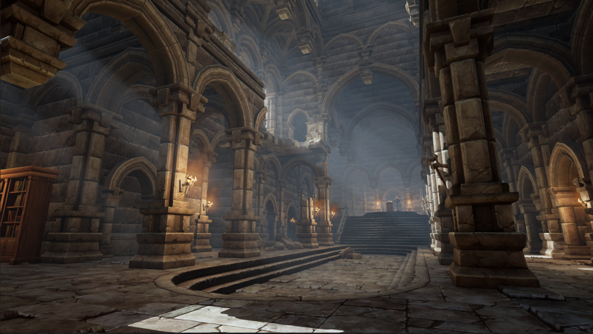
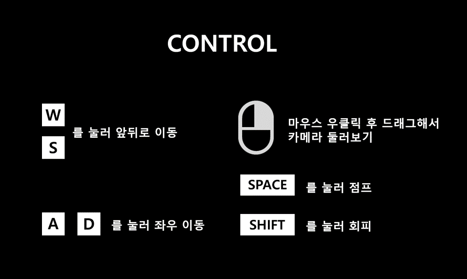

# 2019 소프트웨어 융합대학 캡스톤 디자인Ⅰ 16조 Surreal

# REVISION

### github 주소 -> https://github.com/kookmin-sw/2019-cap1-2019_16
### Trello -> https://trello.com/b/hbH84neL

#

## 1. 프로잭트 소개

Unreal Engine으로 제작한 PC 플랫폼의 3D 어드벤쳐 RPG 게임 LostDark 입니다. 게임 중 조작은 키보드와 마우스를 사용합니다. 플레이어는 스토리의 진행에 따라 퀘스트를 수행하거나 필드의 몬스터를 처치하고 보상으로 경험치를 얻고 성장합니다. 게임 진행 중에 퀘스트를 통해 사용자에게 자율성을 부여하여 선택할 수 있는 분기점을 제공합니다. 던전의 최종 보스를 물리치면 게임이 끝납니다. 게임 진행 중 플레이어의 선택에 따라 엔딩이 달라집니다.

## 2. Abstract

LostDark is a 3D adventure RPG game on PC platform created with Unreal Engine. During the game, use the keyboard and mouse to operate. As the story progresses, the player performs quests, kills monsters in the field, and gains experience as a reward. During the game, the user can be given autonomy through quests and provide a branch point to choose from. The game ends when you defeat the final boss of the dungeon. The ending will depend on the player's choice during the game.

## 3. 소개 영상

사진을 클릭하면 유튜브로 이동합니다.

## 4. 팀 소개

### 김성훈(팀장)
* 학번 : 20133203
* Email : 610ksh@kookmin.ac.kr
* 역할 : Camera Setting, Character(AI, Moving, Attack), Game Menu & System UI, Map Level Design

### 김종균
* 학번 : 20103319
* Email : kimzoo30@naver.com
* 역할 : Character(Dodge) , Scene Change 및 Camera 연출, Matinee, Map Level Design, Character UI

### 송영륜
* 학번 : 20143070
* Email : songyr01@kookmin.ac.kr
* 역할 : Enemy(AI, Moving, Attack), Enemy Variation, Boss(AI, Moving, Attack, Skill), Mob UI

### 장윤지
* 학번 : 20153222
* Email : engineering11111@gmail.com
* 역할 : Camera Moving, NPC Variation, Quest System, System UI(Mini Map, Inventory), Character UI 

### 갈경달
* 학번 : 20155277
* Email : 748075155@qq.com
* 역할 : Tester, 시나리오 중국어 번역

## 5. 사용법

1) 플레이어 이름 입력
2) 게임 접속 및 시작
3) NPC 대화와 맵 구조를 따라 게임 진행
4) 던전 입장
5) 보스몬스터와 전투
6) 엔딩

## 6. 개발 현황

#### 1) 조작법

- 키보드(WASD)를 사용한 플레이어 이동
- 마우스 좌클릭 시 공격
- 마우스 우클릭 시 시점 좌우 회전
- Shift키를 눌러 회피

#### 2) 게임 시스템
- 몬스터가 플레이어를 발견하면 추적, 공격, 공격받고 HP 0이 되면 사망
- NPC를 마우스 좌클릭 시, NPC와 대화
- 맵과 맵을 이동 시, Fade in/out 효과와 함께 Scene 전환
- Mini Map을 통해 현재 위치를 파악

## 7. 그래픽 리소스

1) Elemental Demo
2) FX Variety Pack
3) Infinity Blade: Adversaries
4) Inventory System
5) Multistory Dungeons
6) Quadruped Fantasy Creature
7) Roll and Dodges Animation Set
8) User Interface Kit
9) Paragon: Gideon
10) Paragon: Greystone
11) Paragon: Kwang
12) Infinity Blade: Fire Lands
13) Infinity Blade: Grass Lands
